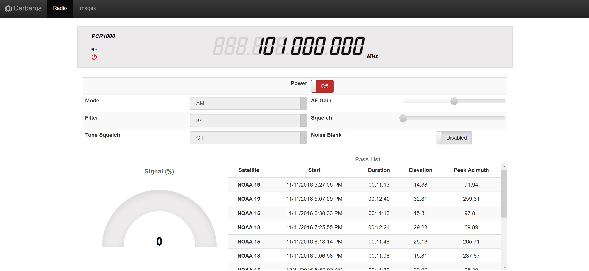

Cerberus
========

Icom PCR1000 Radio control program. Designed to use the network portion of the unofficial C# PCR1000 wrapper API (https://github.com/mrkno/PCR1000-API). Provides Node.JS async bindings for interacting with the radio.

Features:
--------
- All origional features of the IC-PCR1000 software (remote control using browser)
- Live client syncing
- Live audio streaming
- Low overhead webserver (designed to run on a Raspberry Pi)
- Automatic satellite pass control [50% done]
- Automatic hosting of weather satellite imagery from WXtoImg

This is currently being used to control the webserver here: http://sat.makereti.co.nz/ (or look at the example image below).

License:
--------
Released under the MIT license.

All pull requests welcome.